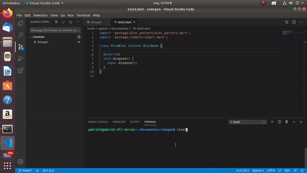

# Flutter blocgen

A flutter code generator for the bloc pattern built in python

## purpose
This project is a faster way to create the variables and (getters and setters) for the block pattern on [Flutter](https://flutter.dev/)

## Installation

you can download the source code file and place it in "/usr/bin" folder to call from the terminal.
***like this*** :

```script
$ wget https://raw.githubusercontent.com/GabrielGCardoso/blocgen/master/blocgen
$ sudo chmod +x blocgen
$ sudo mv blocgen /usr/bin
```

## Usage

```script
$ blocgen generate variable [NameOfYourVariable] -p [pathToYourFile]
or
$ blocgen g v [NameOfYourVariable] -p [pathToYourFile]
```

## Example



## Contributing
Pull requests are welcome. For major changes, please open an issue first to discuss what you would like to change.

You can also create a fork and create another generator for your needs.

## License
[MIT](https://choosealicense.com/licenses/mit/)
